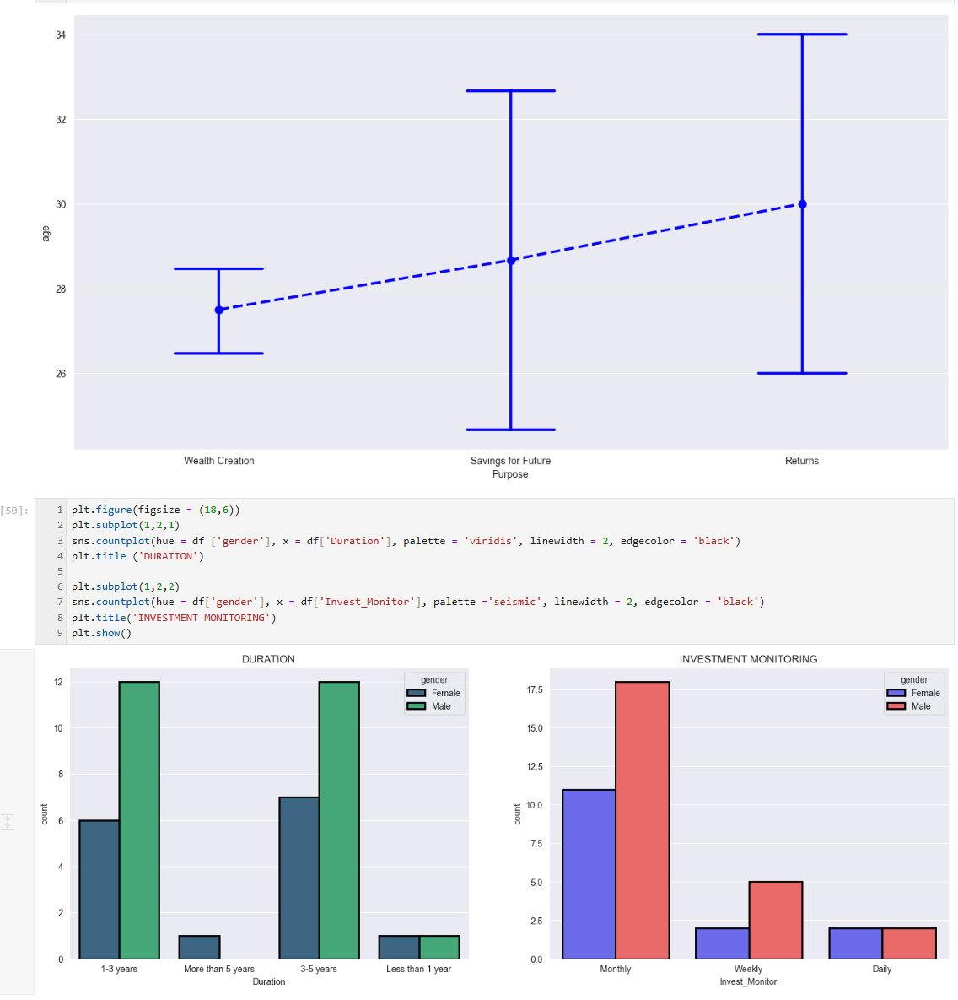

📊 Finance Analysis Project

🔍 Overview
This project explores customer investment behaviour using Python and data analysis techniques. The goal was to identify trends in investment preferences, demographics, and financial decision-making patterns.


---

🚀 Key Insights
- Majority of investors prefer **equity and mutual funds** over traditional instruments
- **Male investors dominate high-risk investment categories**
- Investment duration trends show a strong preference for **short to medium-term investments**
- Financial awareness is primarily driven by **internet and financial consultants**

---

🛠️ Tools & Technologies
- Python (Pandas, NumPy)
- Data Visualisation (Matplotlib, Seaborn)
- Jupyter Notebook

---

📁 Project Structure
---

📈 Key Analysis Performed
- Data cleaning and preprocessing
- Exploratory Data Analysis (EDA)
- Feature analysis (age, gender, investment type)
- Visualisation of behavioural trends

---

📊 Sample Visualisations


---
💡 Value to Business
This analysis helps financial institutions:
- Understand customer investment behaviour
- Tailor financial products to specific demographics
- Improve customer engagement strategies

---

▶️ How to Run
```bash
pip install -r requirements.txt
jupyter notebook notebooks/analysis.ipynb

Author
Darlington 
